+++
title = "Représenter le mouvement"
date = 2023-01-13T10:26:20+01:00
draft = false
outputs = ["Reveal"]

theme = ["solarize"]

[reveal_hugo]
theme = "solarized"

[[reveal_hugo.plugins]]
name = "RevealD3"
source = "plugin/reveal.js-d3/reveald3.js"

+++

### Représenter le mouvement 

##### Ingénieurs, philosophes et mages

 ---

#### Sources

 - Mouvements de l'air : Étienne-Jules Marey, photographe des fluides, Georges Didi-Huberman et Laurent Mannoni

 - All Light, Everywhere, Theo Anthony

Slides : https://kipple.be/slides/graphique_sociotechnique/

 --- 

#### Plan

 - Étienne-Jules Marey et la méthode graphique

 - Henri Bergson : incertitudes  et mouvement

 - Graphique sociotechnique aujourd'hui et demain 

 - Conclusion et retour sur le journalisme local

 --- 

### Controverse du tournant du XIXe siècle

##### Étienne-Jules Marey et Henri Bergson

 --- 

{}

### Étienne-Jules Marey

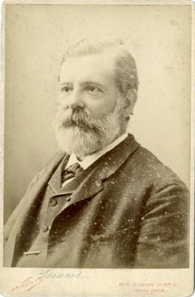

 --- 

- 1830-1904

- Médecin et physiologiste

 --- 

> Exprime les phénomènes les plus variés, transforme d'obscures statistiques en une exposition lumineuse, condense sous le regard et fait embrasser d'un coup d'oeil une quantité énorme de documents

 ---

Représenter le mouvement de toute choses

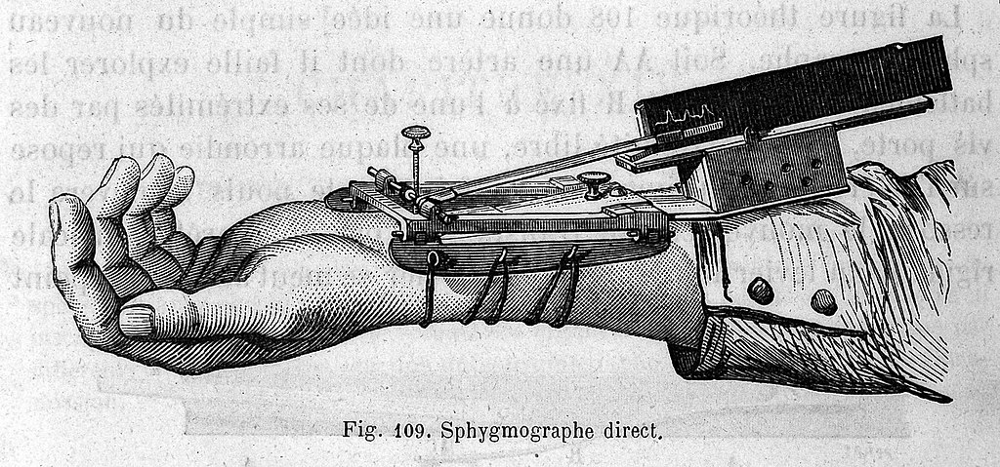

 --- 

- Chronophotographie

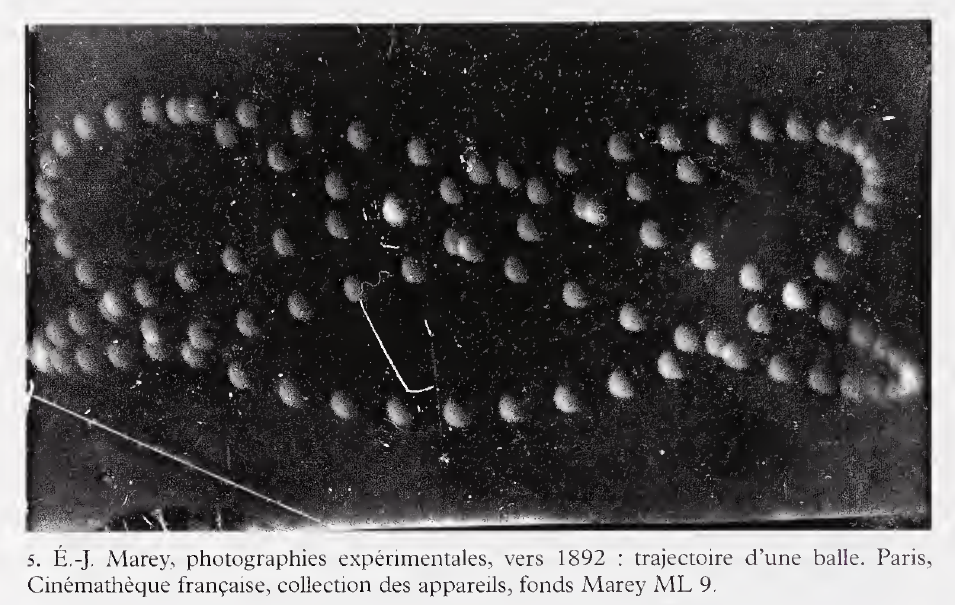

 --- 

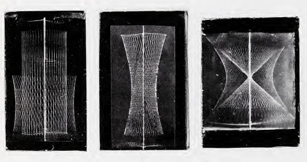

 ---

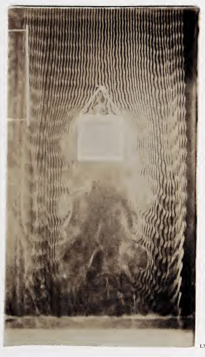

 --- 

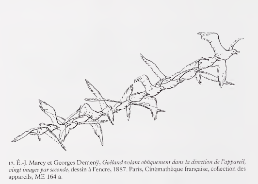

 --- 

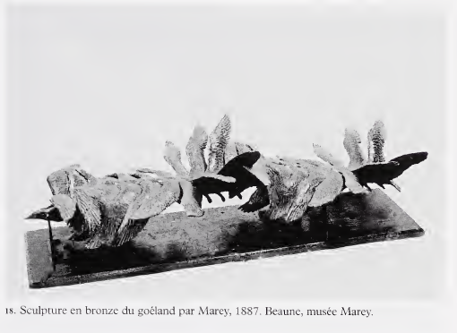

 --- 

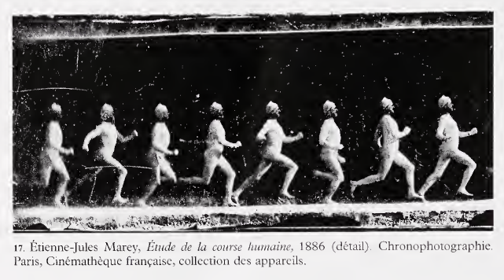

 --- 

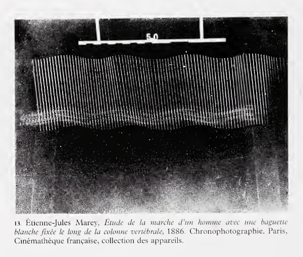

{}
 
 --- 

{}

### Henri Bergson

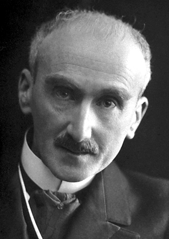  

 --- 

##### Henri Bergson

 - Philosophe de la nouveauté et de la durée

 --- 

 - Espace et temps

 - Hétérogénéité pure
 
 - Intuition, connaissance immanente du mouvement
 
 --- 

### Peut-on découper un mouvement ?

 --- 

#### Illusion cinématographique

 - Nie l'essence-même du mouvement, la mobilité

 - L'enveloppe et le papillon

 --- 

{}

 --- 

{}

### Croisements

 --- 

#### Un Marey bergsonnien

 - Image et intuition, concept et système

 - Représenter l'incertitude

 - Traces, nuances et franges indécises 

 - Images-experiences (Michel Frizot) -> Image-intuition
 
 ---

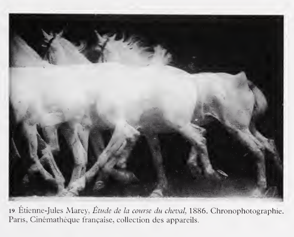  

 --- 

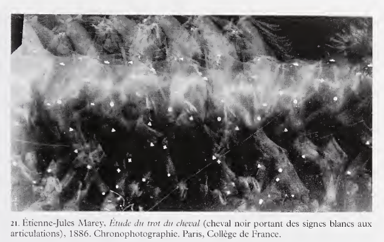  
 
 --- 

#### L'art surréaliste

 - Écriture automatique

 --- 
#### Max Ernst, le nageur aveugle

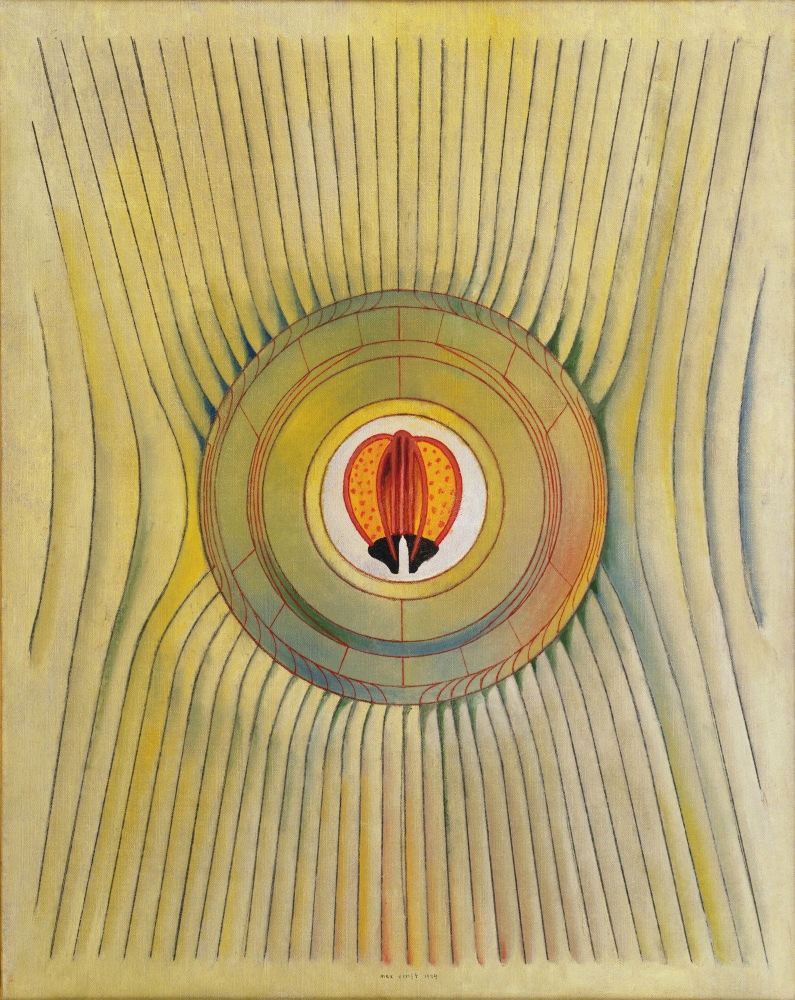

{}

 --- 

{}

### Graphique sociotechnique

 --- 

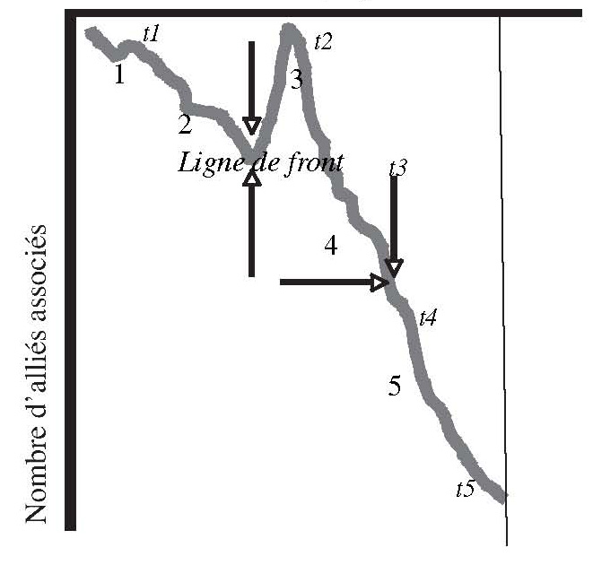

 --- 

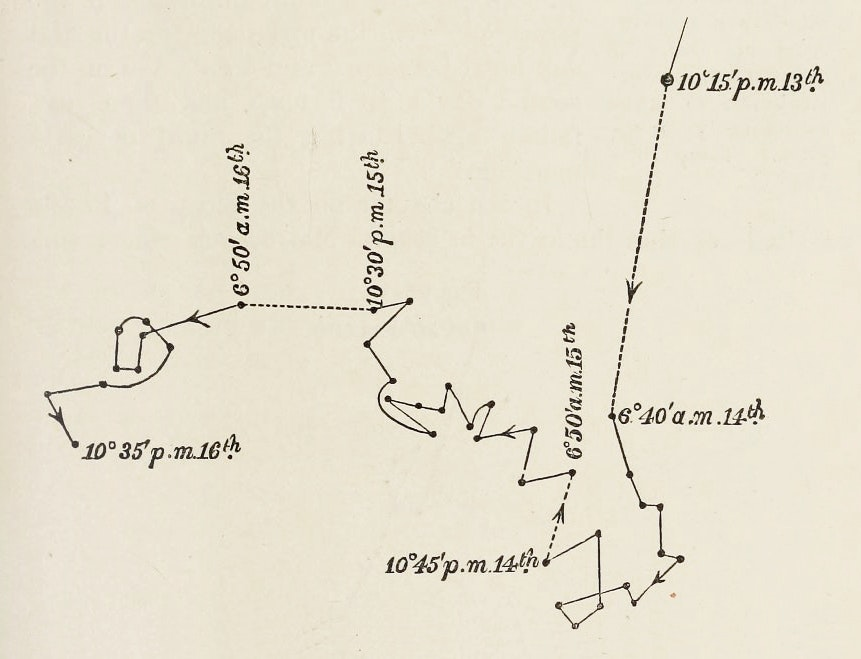  

 --- 

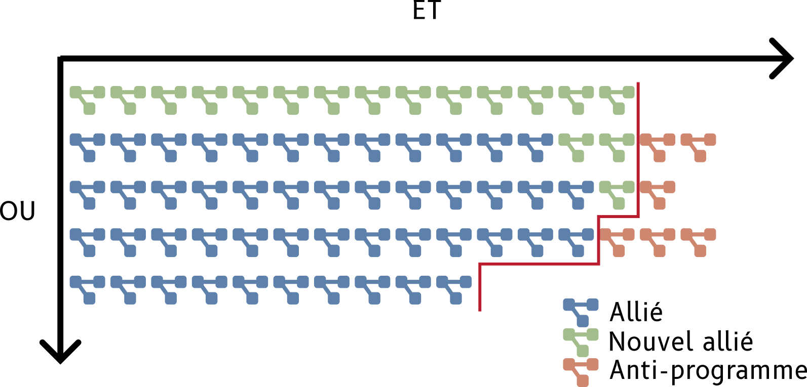

 --- 

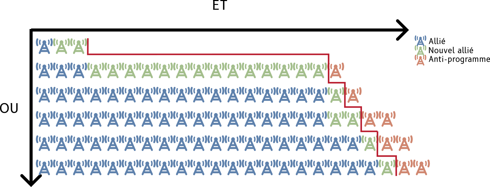

 --- 

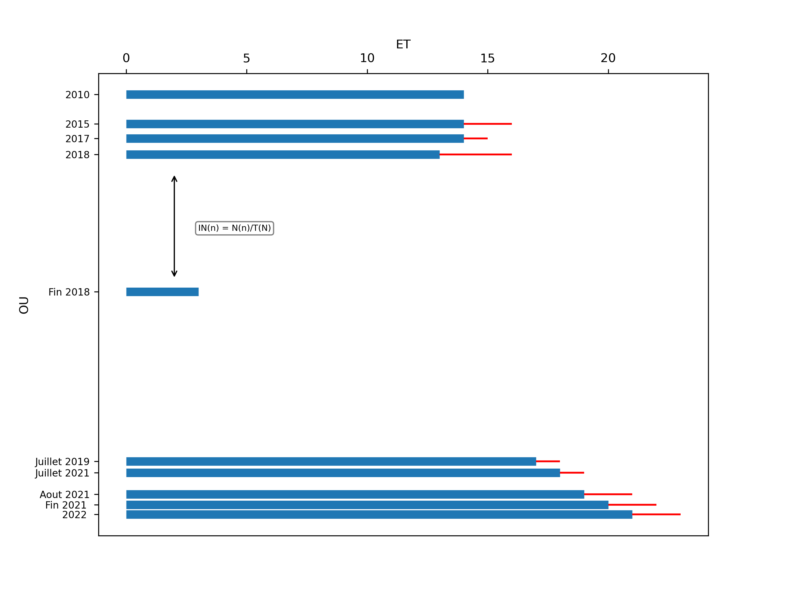

 --- 

#### Facilité sa production pour permettre sa vocation comparative

 --- 



https://github.com/GlozingNeuter/vigilant-octo-barnacle

 --- 

#### Rendre compte de l'incertitude et de la durée

 - Produire des images expérimentales
 
 - Étrangeté comme force

 --- 



 --- 



{}

 --- 

### Conclusion et retour au journalisme local

#### Courbe globale, aspect local

 --- 

##### Tension traversant l'histoire du journalisme local

 - 

 - 

 - 

 ---

> Il est de l'essence de l'image de contenir quelque chose d'éternel. Cette éternité s'exprime par la fixité et la stabilité du trait, mais peut aussi s'exprimer, de façon plus subtile, grâce à une intégration dans l'image même de ce qui est fluide et changeant."

 Walter Benjamin
